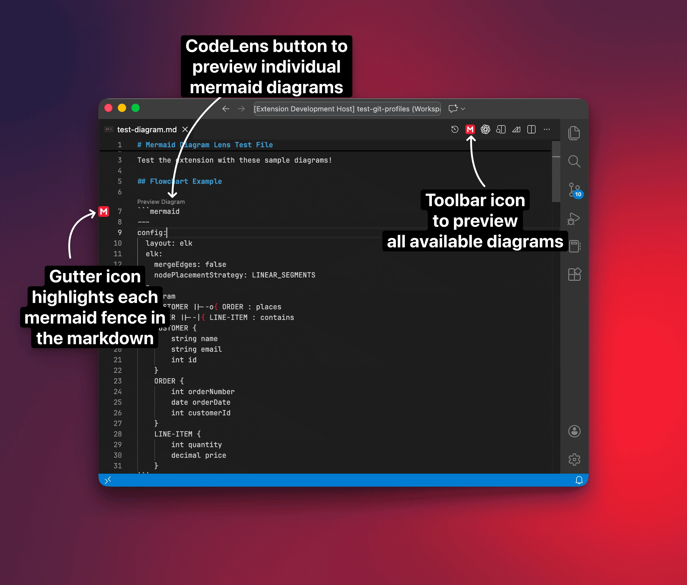
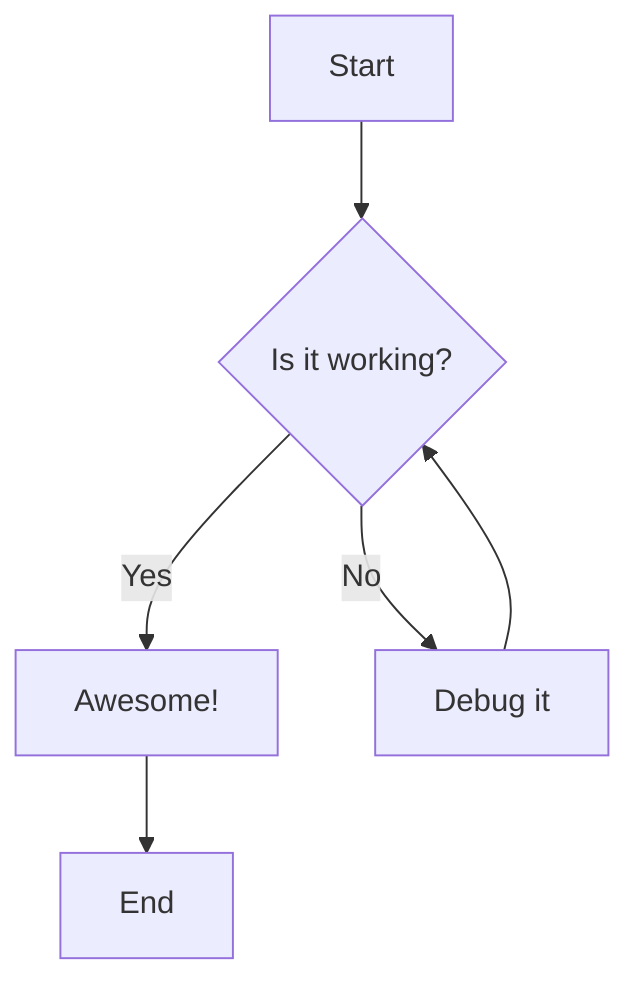

# Mermaid Diagram Lens

A VSCode extension that gives you a focused lens into Mermaid diagrams with independent theme selection, appearance overrides, and export controls. Everything stays local-no accounts, Copilot prompts, or external services-while the dedicated preview surface (plus CodeLens buttons and gutter highlights) keeps multi- and single-diagram workflows fast.

## Features

- **Independent Theme Selection**: Choose from multiple Mermaid themes (default, dark, forest, neutral, base) directly in the preview panel
- **Optional VSCode Theme Sync**: Toggle option to automatically sync Mermaid theme with your VSCode theme (dark/light)
- **Live Preview**: Automatic preview updates as you edit your Mermaid diagrams
- **Rich Preview Toolbar**: Zoom, pan, reset, navigate between diagrams, and change the preview chrome (match VS Code, light, or dark) without leaving the panel
- **Export Options**: Save any diagram as SVG, PNG, or JPG right from the preview toolbar
- **On-Document Shortcuts**: Click the CodeLens button or gutter icon on each mermaid fenced block to open the preview (to the side) without leaving the editor
- **Side-by-Side View**: Open preview beside your editor for convenient editing
- **Theme Persistence**: Save your preferred theme as default
- **Multi-Diagram Support**: Preview every Mermaid block in a document and jump between them with the toolbar navigation controls
- **Offline Friendly**: Bundles Mermaid 11.12.2 locally, so previews work without a network connection or account

## Demo


## Usage

### Opening the Preview

1. Open a Markdown file containing Mermaid diagrams
2. Use one of these methods:
   - Click the preview icon in the editor title bar
   - Right-click in the editor and select "Mermaid Diagram Lens: Open Preview"
   - Use Command Palette (`Cmd+Shift+P` / `Ctrl+Shift+P`) and search for "Mermaid Diagram Lens: Open Preview"
   - For side-by-side view: "Mermaid Diagram Lens: Open Preview to the Side"

### Changing Themes

In the preview panel toolbar:
- Use the **Theme** dropdown to select different themes
- Check **"Sync with VSCode theme"** to automatically match VSCode's theme
- Click **"Save as Default"** to persist your theme choice

### Previewing Individual Diagrams

- A **CodeLens button** labeled *Preview Diagram* appears above every mermaid fenced block; clicking it opens a new panel focused solely on that diagram.
- A subtle **gutter icon** highlights each Mermaid fence, so you can spot diagrams quickly (it's a visual cue only; use the CodeLens to open the preview).
- The editor toolbar/title icon still opens the multi-diagram preview, so you can see every Mermaid block at once.



### Supported Themes

- **Default**: Classic Mermaid theme with clean, neutral colors
- **Dark**: Dark background with light elements
- **Forest**: Green-themed palette
- **Neutral**: Minimalist grayscale theme
- **Base**: Simple base theme

## Configuration

Configure the extension through VSCode settings:

```json
{
  // Default theme for Mermaid diagrams
  "mermaidLens.theme": "default",

  // Automatically sync Mermaid theme with VSCode theme
  "mermaidLens.useVSCodeTheme": false,

  // Automatically refresh preview on document changes
  "mermaidLens.autoRefresh": true,

  // Delay in milliseconds before refreshing preview after changes
  "mermaidLens.refreshDelay": 500
}
```

## Example Mermaid Diagram

````

````
## Commands

- `Mermaid Diagram Lens: Open Preview` – Shows every Mermaid fence from the active Markdown file in the current editor column.
- `Mermaid Diagram Lens: Open Preview to the Side` – Same multi-diagram preview, but always opens in the column beside the editor for live editing.
- `Mermaid Diagram Lens: Preview Diagram Here` – Focuses only the Mermaid block at the current cursor (or the CodeLens/gutter target) and keeps that single-diagram panel in sync while you type.

## Requirements

- VSCode 1.85.0 or higher
- Markdown files with Mermaid code blocks

## Known Limitations

- Only previews Mermaid diagrams within mermaid fenced code blocks

## Extension Settings

This extension contributes the following settings:

* `mermaidLens.theme`: Choose the default Mermaid theme
* `mermaidLens.useVSCodeTheme`: Sync theme with VSCode
* `mermaidLens.autoRefresh`: Enable/disable auto-refresh
* `mermaidLens.refreshDelay`: Set refresh delay in milliseconds

## Release Notes

### 0.0.1

Initial release:
- Mermaid diagram preview
- Multiple theme support
- Independent theme selection
- Optional VSCode theme sync
- Live preview updates
- Theme persistence

## Contributing

Found a bug or have a feature request? Please open an issue!

## License

MIT - if you build on Mermaid Diagram Lens, please keep the copyright notice intact and include attribution to Utkarsh Shigihalli in your distribution or documentation.
