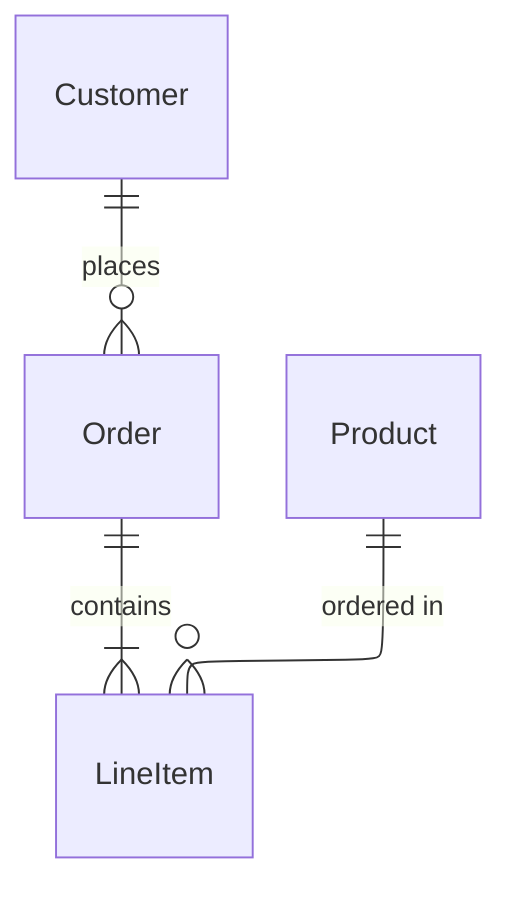
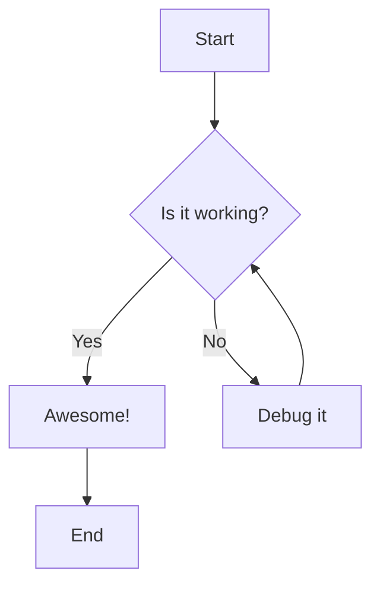

# Mermaid Viewer

A VSCode extension that gives you a powerful viewer for Mermaid diagrams with independent theme selection, appearance overrides, and export controls. Everything stays local-no accounts, Copilot prompts, or external services-while the dedicated preview surface (plus CodeLens buttons and gutter highlights) keeps multi- and single-diagram workflows fast.

## Features

- **Syntax Highlighting**: Full syntax highlighting for Mermaid diagrams in markdown code blocks and standalone `.mmd`/`.mermaid` files
- **Live Preview**: Automatic preview updates as you edit, with side-by-side layout and multi-diagram support (navigate between blocks with the toolbar controls)
- **Theming**: Choose from five built-in themes (default, dark, forest, neutral, base), optionally sync with your VS Code theme, and save your preference as the default
- **Preview & Navigation**: Toolbar with zoom (`+`/`-`), pan (arrow keys or drag), reset (`R`), reload, appearance override (match VS Code, light, or dark), and an interactive minimap for navigating large diagrams. Works with keyboard shortcuts too.
- **Annotation Tools**: Draw directly on diagrams with pen (red/blue/green), laser pointer with fade-out, and shape tools (arrows, lines, rectangles, ellipses). Annotations remain available while using Diagram Search and are not altered by search highlighting. Keyboard shortcuts make annotation fast: **P** for pen, **L** for laser, **S** for shapes, **R/G/B** to cycle colors for both pen and shape tools, **E** to erase all
- **Diagram Search**: Press `Ctrl+F` (`Cmd+F` on macOS) in the preview to find text in entities, labels, notes, messages, and relationships; matching text is highlighted and results cycle with `Enter` or `Shift+Enter`
- **On-Document Shortcuts**: CodeLens buttons and gutter icons on every Mermaid block let you open a focused single-diagram preview without leaving the editor
- **Export & Copy Image**: Save or copy any diagram as SVG, PNG (1x-4x), or JPG (1x-4x) from the toolbar - dimensions shown before you export
- **Copy Source**: Copy raw Mermaid code via CodeLens or command palette
- **Copy with Wrapper**: Wrap copied code in a configurable template - useful for platforms that require a specific syntax (e.g. Azure DevOps). Configure via `mermaidViewer.copy.wrapper` in settings, using `{{mermaid-code}}` for the diagram code, `{{fileName}}` for the source file's name, and `{{date:FORMAT}}` for the copy date/time:
  ```
  :::mermaid
  {{mermaid-code}}
  :::
  ```

- **Format Diagram**: Tidy a diagram's indentation and whitespace via CodeLens, command palette, or context menu. Standalone `.mmd`/`.mermaid` files also work with VS Code's built-in *Format Document* (`Shift+Alt+F`). Formatting is conservative and works across diagram types - it normalizes nesting indentation (flowchart `subgraph`/`end`, sequence `loop`/`alt`/`opt`/`par`/`critical`, class/state/ER/C4 braces, `block` groups, `gantt`/`journey` sections, multi-line state notes), trims trailing whitespace, and collapses blank lines without altering the diagram. Re-indenting is applied only to recognized structural diagram types; types where indentation is meaningful (`mindmap`, `kanban`, `treemap`, `sankey`) and any unrecognized diagram type are left un-indented on purpose - only trailing whitespace is trimmed
- **Formatting Diagnostics**: Lines that don't match the formatting rules get a warning squiggle. Use the lightbulb (Quick Fix) on a squiggle to **Fix formatting on this line** (one at a time) or **Format Mermaid diagram** (the whole block at once). Toggle with `mermaidViewer.format.diagnostics`
- **ELK Layout Support**: Use the [ELK layout engine](https://eclipse.dev/elk/) for complex diagrams by adding `layout: elk` frontmatter - works with ER diagrams, flowcharts, and more. Loaded on demand, so there is no cost for diagrams that use the default layout
- **Offline Friendly**: Bundles Mermaid locally, so previews work without a network connection or account

## Demo


## Usage

### Opening the Preview

1. Open a Markdown file containing Mermaid diagrams
2. Use one of these methods:
   - Click the preview icon in the editor title bar
   - Right-click in the editor and select "Mermaid Viewer: Open Preview"
   - Use Command Palette (`Cmd+Shift+P` / `Ctrl+Shift+P`) and search for "Mermaid Viewer: Open Preview"
   - For side-by-side view: "Mermaid Viewer: Open Preview to the Side"
   - For a separate floating window: "Mermaid Viewer: Open Preview in New Window"
3. The toolbar/title icon uses "Open Preview to the Side" behavior by default; set `mermaidViewer.defaultPreviewLocation` to `newWindow` to make it open in a new window instead

### Changing Themes

In the preview panel toolbar:
- Use the **Theme** dropdown to select different themes
- Check **"Sync with VSCode theme"** to automatically match VSCode's theme
- Click **"Save as Default"** to persist your theme choice

### Previewing Individual Diagrams

- A **CodeLens button** labeled *Preview Diagram* appears above every Mermaid block in Markdown (fenced `mermaid` blocks and `::: mermaid` containers); clicking it opens a panel focused on that diagram.
- In standalone `.mmd`/`.mermaid` files, the CodeLens appears at the top so you can preview or copy quickly.
- A subtle **gutter icon** highlights Mermaid block starts in Markdown, so you can spot diagrams quickly (it's a visual cue only; use CodeLens to open preview).
- The editor toolbar/title icon still opens the multi-diagram preview, so you can see every Mermaid block at once.

### Navigating with the Minimap

Hover over the map icon in the lower-right corner of the preview to reveal an overview of the active diagram. The outlined area shows the current viewport; click or drag within the minimap to move around large diagrams quickly.


### Searching Entities and Labels

Press `Ctrl+F` (`Cmd+F` on macOS) in the preview to search rendered Mermaid entities, labels, notes, and relationships. Matching text is highlighted across the diagram; press `Enter` or `Shift+Enter` to move between results and focus the active entity or edge.


### Copying Diagram Code

- **Copy** (`Preview | Copy` CodeLens): Copies the raw Mermaid source for the block, respecting the `copy.includeFrontMatter` setting for standalone files.
- **Copy with Wrapper**: Wraps the diagram code in the template configured in `mermaidViewer.copy.wrapper` before copying. Useful for pasting into platforms that require a specific syntax, such as Azure DevOps (`::: mermaid ... :::`).
  - Available via right-click context menu, command palette, or a custom keyboard shortcut.
  - If the code already contains the wrapper, it won't be applied twice.
  - Use `{{fileName}}` in the template to include the source file's name (e.g. useful as a heading or comment above the diagram).
  - Use `{{date:FORMAT}}` to stamp the copy date/time, with tokens `yyyy`, `yy`, `MMM`, `MM`, `dd`, `HH`, `mm`, `ss` (e.g. `{{date:dd-MMM-yyyy}}`).
  - Configure the wrapper in settings:
    ```json
    "mermaidViewer.copy.wrapper": ":::mermaid\n{{mermaid-code}}\n:::"
    ```


### Using ELK Layout

For complex diagrams where the default dagre layout produces crowded or hard-to-read results, you can switch to the [ELK layout engine](https://eclipse.dev/elk/) by adding a frontmatter config block:

````

```mermaid
---
config:
  layout: elk
---
erDiagram
  Customer ||--o{ Order : places
  Order ||--|{ LineItem : contains
  Product ||--o{ LineItem : "ordered in"
```
````

ELK layout is supported on ER diagrams, flowcharts, and any other diagram type that accepts a `layout` config. The ELK engine is loaded on demand (only when a diagram requests it), so there is no performance cost for diagrams that use the default layout.

ELK also supports several sub-algorithms via `layout: elk.<algorithm>`:

| Algorithm          | Description                            |
| ------------------ | -------------------------------------- |
| `elk`              | Layered layout (default ELK algorithm) |
| `elk.stress`       | Force-directed stress minimization     |
| `elk.force`        | Simple force-directed layout           |
| `elk.mrtree`       | Compact tree layout                    |
| `elk.sporeOverlap` | Overlap removal                        |

### Supported Themes

- **Default**: Classic Mermaid theme with clean, neutral colors
- **Dark**: Dark background with light elements
- **Forest**: Green-themed palette
- **Neutral**: Minimalist grayscale theme
- **Base**: Simple base theme

### Annotation Tools

Newly added annotation tools allow you to walk through service boundaries, data flows, and integration points live while drawing arrows and highlights directly on the diagram, and there is also a laser pointer to focus attention during presentations.

All tools have smooth anti-aliased rendering and respect the current zoom level.


#### Pen Tool

Draw freehand strokes on the diagram with a smooth brush.

- **Activate**: Press `P` or click the pen button in the toolbar
- **Colors**: Press `R` (red), `G` (green), or `B` (blue) to change color for pen and shape tools; the dot icon shows the active color
- **Draw**: Click and drag to draw
- **Persistent**: Strokes remain on the diagram until erased

#### Laser Pointer

Draw temporary strokes that fade away after 2 seconds.

- **Activate**: Press `L` or click the laser button
- **Use**: Click and drag to draw; the stroke will fade with a glowing effect
- **Deactivate**: Press `L` again or press `Esc`

#### Shape Tool

Draw geometric shapes: arrows, lines, rectangles, and ellipses.

- **Activate**: Press `S` or click the shape button
- **Cycle shapes**: Press `S` again to cycle through arrow → line → rectangle → ellipse
- **Colors**: Press `R`, `G`, or `B` to set color before drawing (same shortcuts as the pen tool)
- **Draw**: Click and drag from start to end point

#### Erase All

- **Erase**: Press `E` or click the erase button to remove all annotations from the diagram

#### Exit Annotation Mode

- **Deactivate**: Press `Esc` to exit annotation mode and return to pan/zoom controls

## Configuration

Configure the extension through VSCode settings:

```json
{
  // Default theme for Mermaid diagrams
  "mermaidViewer.theme": "default",

  // Automatically sync Mermaid theme with VSCode theme
  "mermaidViewer.useVSCodeTheme": false,

  // Automatically refresh preview on document changes
  "mermaidViewer.autoRefresh": true,

  // Delay in milliseconds before refreshing preview after changes
  "mermaidViewer.refreshDelay": 500,

  // Where the toolbar icon opens the preview: "side" or "newWindow"
  "mermaidViewer.defaultPreviewLocation": "side",

  // Include frontmatter when copying from standalone .mmd/.mermaid files
  "mermaidViewer.copy.includeFrontMatter": true,

  // Template used when copying with wrapper. Use {{mermaid-code}} as the diagram code placeholder, {{fileName}} for the source file's name, and {{date:FORMAT}} for the copy date/time (tokens: yyyy, yy, MMM, MM, dd, HH, mm, ss).
  // Example for Azure DevOps:
  "mermaidViewer.copy.wrapper": ":::mermaid\n{{mermaid-code}}\n:::",

  // Show a warning squiggle when a Mermaid diagram is not formatted
  "mermaidViewer.format.diagnostics": true
}
```

## Example Mermaid Diagram

````

```mermaid
graph TD
    A[Start] --> B{Is it working?}
    B -->|Yes| C[Awesome!]
    B -->|No| D[Debug it]
    D --> B
    C --> E[End]
```
````
## Commands

- `Mermaid Viewer: Open Preview` - Shows Mermaid diagrams from the active Markdown or Mermaid file in the current editor column.
- `Mermaid Viewer: Open Preview to the Side` - Same preview behavior, but always opens in the column beside the editor for live editing.
- `Mermaid Viewer: Open Preview in New Window` - Opens the preview in its own floating VSCode window, separate from the main editor window.
- `Mermaid Viewer: Preview Diagram Here` - Focuses only the Mermaid block at the current cursor (or the CodeLens target) and keeps that single-diagram panel in sync while you type.
- `Mermaid Viewer: Copy` - Copies the raw Mermaid source code for the diagram at the current cursor position.
- `Mermaid Viewer: Copy with Wrapper` - Copies the diagram code wrapped in the template from `mermaidViewer.copy.wrapper`. Also available via right-click context menu.
- `Mermaid Viewer: Format Diagram` - Normalizes indentation and whitespace for the diagram at the cursor (Markdown) or the whole file (`.mmd`/`.mermaid`). Standalone files also respond to the built-in *Format Document* command.

### Format on Save

Formatting is also exposed as a `source.fixAll` code action, so you can format every Mermaid diagram in a file automatically on save (including diagrams embedded in Markdown):

```json
"editor.codeActionsOnSave": {
  "source.fixAll.mermaidViewer": "explicit"
}
```

For standalone `.mmd`/`.mermaid` files you can alternatively use `"editor.formatOnSave": true`.

## Requirements

- VSCode 1.85.0 or higher
- Markdown files with Mermaid code blocks (fenced `mermaid`) or ADO-style Mermaid containers (`::: mermaid ... :::`)
- Mermaid files (`.mmd`, `.mermaid`)

## Known Limitations

- Markdown preview supports Mermaid fenced blocks and ADO-style `::: mermaid` containers.
- ADO containers must be properly closed with `:::` to be extracted as a diagram.

## Extension Settings

This extension contributes the following settings:

* `mermaidViewer.theme`: Choose the default Mermaid theme
* `mermaidViewer.useVSCodeTheme`: Sync theme with VSCode
* `mermaidViewer.autoRefresh`: Enable/disable auto-refresh
* `mermaidViewer.refreshDelay`: Set refresh delay in milliseconds
* `mermaidViewer.copy.includeFrontMatter`: Include frontmatter when copying from standalone `.mmd`/`.mermaid` files (default: `true`)
* `mermaidViewer.copy.wrapper`: Template applied by "Copy with Wrapper". Use `{{mermaid-code}}` as the diagram code placeholder, `{{fileName}}` for the source file's name, and `{{date:FORMAT}}` for the copy date/time (tokens: `yyyy`, `yy`, `MMM`, `MM`, `dd`, `HH`, `mm`, `ss`) (default: `{{mermaid-code}}`)

## Contributing

Found a bug or have a feature request? Please open an issue!

## License

MIT - if you build on Mermaid Viewer, please keep the copyright notice intact and include attribution to Utkarsh Shigihalli in your distribution or documentation.
