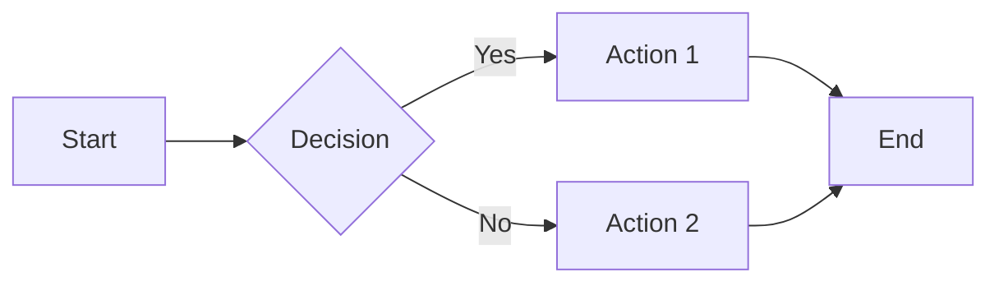
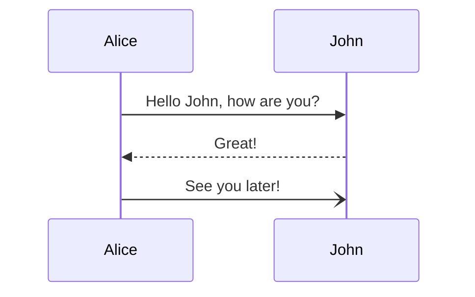
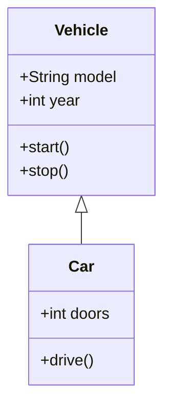
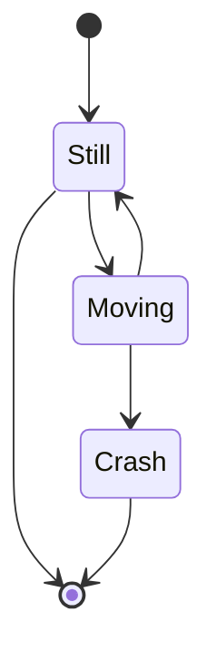
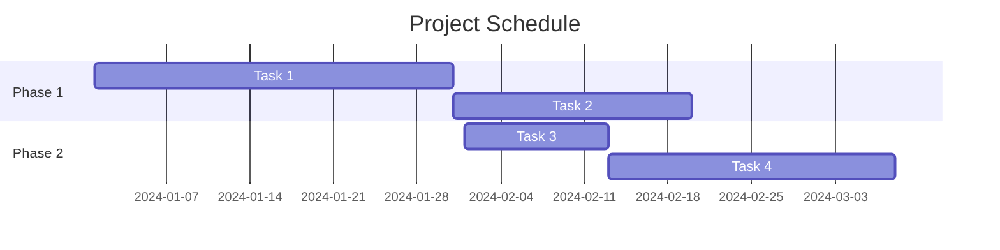
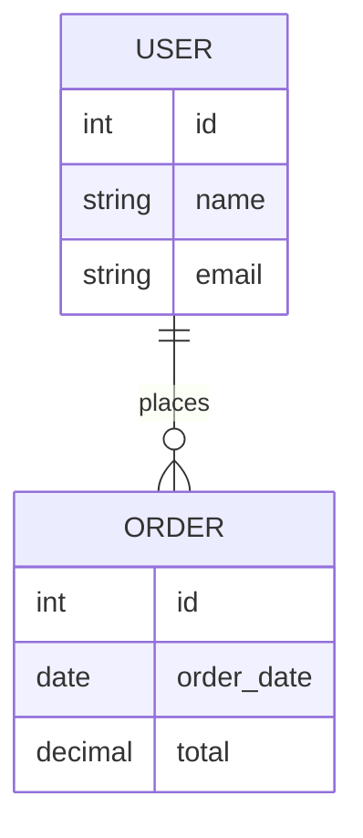
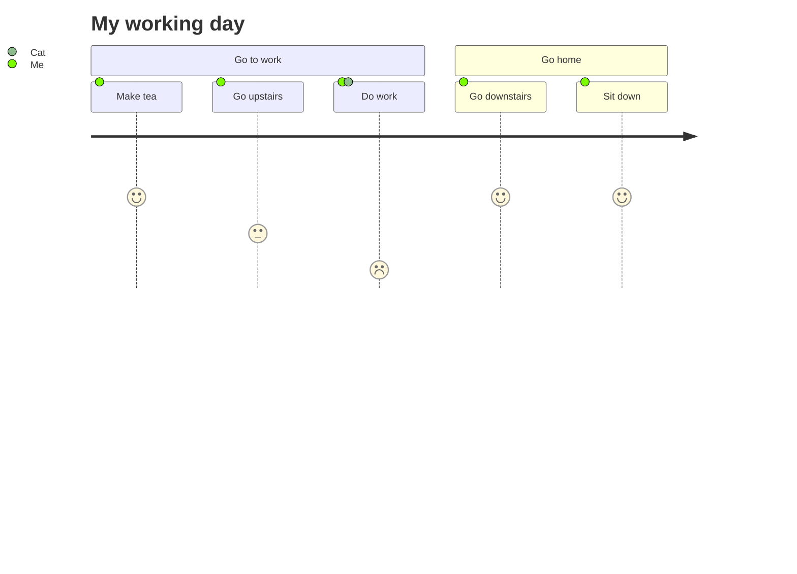
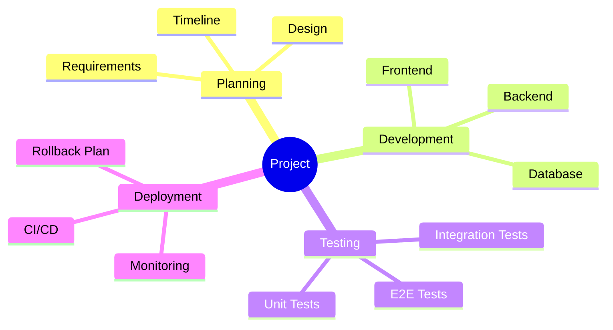
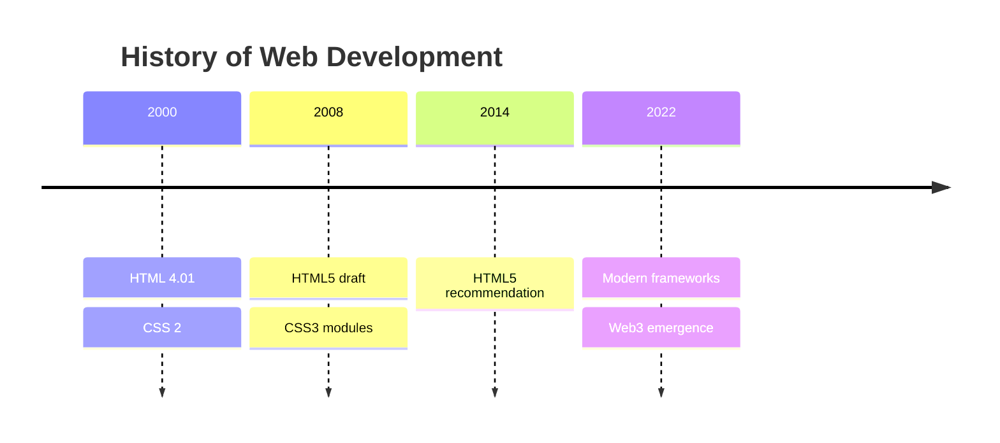

# Mermaid Diagram Examples in Markdown

This file demonstrates various Mermaid diagram types embedded in a Markdown document.

## Flowchart Example

## Sequence Diagram Example

## Class Diagram Example

## State Diagram Example

## Gantt Chart Example

## Entity Relationship Diagram

## Journey Diagram

## Mindmap

## Timeline

